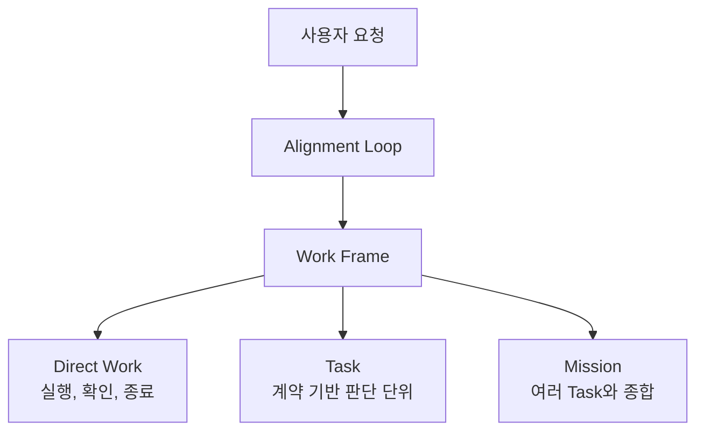
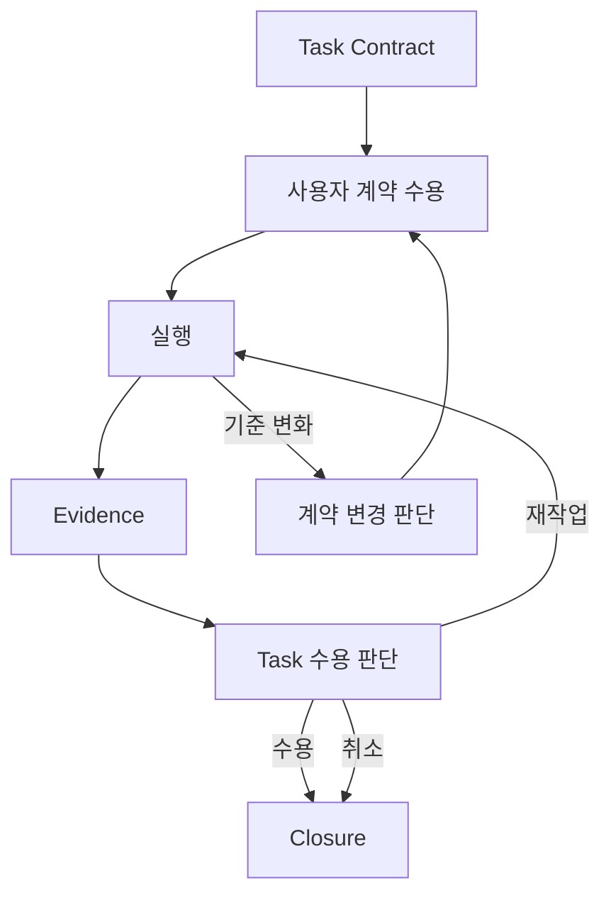

[English](README.md) | 한국어


# Geas

Geas는 AI agent 작업을 명확한 계약, 실행, 검증 근거, 수용 판단, 회고로 구조화해 사람이 더 낮은 비용으로 책임 있게 결과를 판단할 수 있게 하는 운영 원칙과 Skill 묶음입니다.

## Geas가 필요한 이유

AI agent는 산출물을 빠르게 만들 수 있습니다. 하지만 빠른 산출물이 어떤 목표와 기준으로 만들어졌는지, 무엇을 확인했는지, 무엇을 확인하지 못했는지 남지 않으면 사람이 결과를 다시 검토하고 수용 판단하는 비용이 커집니다.

Geas가 줄이려는 것은 agent의 실행 시간이 아니라 사람이 결과를 검토하고, 수용 판단을 내리고, 유지하고, 다음 작업으로 이어가기까지 드는 총 비용입니다. 빠른 생성이 검증 근거와 미검증 범위를 갖춘 작업 상태로 남아야 장기적으로 더 이어가기 쉬운 프로젝트가 됩니다.

## 도입 효과

- 모호한 요청을 Mission과 Task 계약으로 바꿔 실행 기준과 제외 범위를 선명하게 합니다.
- 큰 작업을 사람이 판단 가능한 Task 단위로 나눠 검토와 재작업 부담을 낮춥니다.
- 수용 기준, verification checks, review focus를 먼저 정해 결과를 무엇으로 판단할지 고정합니다.
- 구현 결과와 함께 검증 근거, 미검증 범위, 남은 위험을 남겨 근거 기반 수용 판단을 돕습니다.
- 구현, 검증, 리뷰, 챌린지를 분리해 산출물의 맥락, 품질, 누락, 장기 위험을 따로 확인합니다.
- 작업 중 기준이 바뀌면 조용히 범위를 넓히지 않고 기준 갱신과 재검토로 되돌립니다.
- 끊긴 작업도 Mission 기준, Task 기준, Evidence, User Judgment, 이어받기 맥락을 바탕으로 다시 이어갈 수 있습니다.
- 남은 한계와 반복 가능한 교훈을 Closure 기록과 유형별 memory로 남겨 다음 작업으로 연결합니다.

## Geas란 무엇인가

Geas는 agent 작업을 다음 흐름으로 다루는 기본 운영 원칙입니다.

- 작업 전에 목표, 범위, 산출물, 검증 방법, 하지 않을 일을 계약으로 고정합니다.
- agent는 계약 안에서 실행하고, 검증 근거와 미검증 범위를 남깁니다.
- 사람은 그 근거를 검토하고 결과를 수용할지 판단합니다.
- 작업에서 드러난 사실은 다음 작업을 위한 회고와 기억으로 남깁니다.

이 repository에는 그 원칙을 실행하기 위한 문서, Skill workflow, Codex와 Claude Code용 marketplace plugin package가 함께 들어 있습니다.

## 설치

아래 방법 중 하나를 사용합니다.

<details>
<summary>Codex marketplace로 설치</summary>

```text
/plugin marketplace add choam2426/geas
/plugin install geas@geas
```

</details>

<details>
<summary>Claude Code marketplace로 설치</summary>

```text
/plugin marketplace add choam2426/geas
/plugin install geas@geas
```

</details>

<details>
<summary>Codex project-local Skill로 직접 설치</summary>

```bash
git clone https://github.com/choam2426/geas.git
mkdir -p .agents/skills
cp -R geas/plugins/geas/skills/* .agents/skills/
```

</details>

<details>
<summary>Claude Code project-local Skill로 직접 설치</summary>

```bash
git clone https://github.com/choam2426/geas.git
mkdir -p .claude/skills
cp -R geas/plugins/geas/skills/* .claude/skills/
```

</details>

## 사용 방법

Geas를 설치한 뒤 프로젝트에서 Codex나 Claude Code를 열고 `/geas`로 Geas 작업을 시작하거나 이어 갑니다.

작업이 도중에 끊겨도 다시 `/geas`를 호출하면 수용된 Mission 기준, Task 기준, Evidence, User Judgment, 이어받기 맥락을 바탕으로 이어갈 수 있습니다.

```text
/geas 로그인 실패 시 사용자가 원인을 알 수 있도록 오류 메시지 표시 기능 추가
```

```text
/geas 진행 중인 Mission 이어서 진행
```

Geas는 agent가 바로 완료를 선언하게 만들기보다, 먼저 작업 기준을 계약으로 잡고 실행 결과를 Evidence로 남긴 뒤 사람이 검토하고 수용 판단할 수 있게 흐름을 나눕니다.

## 핵심 흐름

모든 요청은 하나의 `Work`가 됩니다. agent는 요청을 Alignment를 거쳐 Work Frame으로 정리한 뒤, 크기, 위험, 판단 비용에 따라 Direct Work, Task, Mission 중 하나로 다룹니다.


```mermaid
flowchart TD
  request["사용자 요청"] --> align["Alignment Loop"]
  align --> frame["Work Frame"]
  frame --> direct["Direct Work<br/>실행, 확인, 종료"]
  frame --> task["Task<br/>계약 기반 판단 단위"]
  frame --> mission["Mission<br/>여러 Task와 종합"]
```

- `Direct Work`는 짧은 Work Frame으로 실행하고, 확인한 것과 남은 한계를 남기고 닫습니다.
- `Task`는 실행 전에 사용자가 수용하는 Task Contract로 실행 기준을 고정하고, Task 수용 판단으로 끝납니다.
- `Mission`은 여러 Task를 Mission Brief 아래 묶고, 수용된 Task 결과를 종합해 Mission 수준에서 판단합니다.

Task는 다음 흐름으로 진행됩니다.


```mermaid
flowchart TD
  contract["Task Contract"] --> accept["사용자 계약 수용"]
  accept --> execute["실행"]
  execute --> evidence["Evidence"]
  evidence --> judgment["Task 수용 판단"]
  judgment -->|"수용"| closure["Closure"]
  judgment -->|"재작업"| execute
  judgment -->|"취소"| closure
  execute -->|"기준 변화"| amend["계약 변경 판단"]
  amend --> accept
```

위험, 영향 범위, 판단 비용이 크면 verification, review, challenge로 Evidence를 강화합니다. 실행 중 기준이 바뀌면 계약을 갱신할지, 유지할지, 취소할지 사용자가 판단합니다 — 작업이 수용된 기준에서 조용히 벗어나지 않습니다.

기록은 `.geas/works/`에 남아 끊긴 Work를 같은 기준으로 재개할 수 있고, 장기 효력이 있는 결정은 `.geas/memory/`에 memory로 남아 다음 작업에 쓰입니다.

## 핵심 개념

- `Work`: 사용자가 위임한 작업 하나입니다. 모든 Work는 Work Frame에서 시작해 Direct Work, Task, Mission 중 하나로 다뤄집니다.
- `Task Contract`: Task 실행 전에 사용자가 수용하는 실행 합의입니다. 목표, 경계, 산출물, 수용 기준, 확인 전략을 담습니다.
- `Mission`: 여러 Task와 판단 지점을 Mission Brief 아래 묶고 Mission 수준 종합으로 끝나는 큰 Work입니다.
- `Evidence`: 결과가 수용된 기준에 어떻게 대조되는지, 무엇을 확인했고 무엇이 미확인으로 남았는지입니다. 완료 선언이 아니라 사용자의 판단 입력입니다.
- `User Judgment`: 결과와 Evidence에 대한 사용자의 명시적 결정입니다. Task는 수용, 재작업, 취소 중 하나, Mission은 수용, 계속, 취소 중 하나입니다.
- `Continuity`: 끊긴 Work를 재개하게 하는 Closure 기록과, 다음 작업을 위해 유형별 memory로 남는 Continuity Artifact입니다.

## 먼저 읽을 문서

- [Geas 정의](docs/definition.md)
- [Geas Workflow](docs/workflow/index.md)
- [Skill 구조](docs/skills.md)

## 라이선스

Apache License 2.0. 자세한 내용은 [LICENSE](LICENSE)를 확인하세요.
