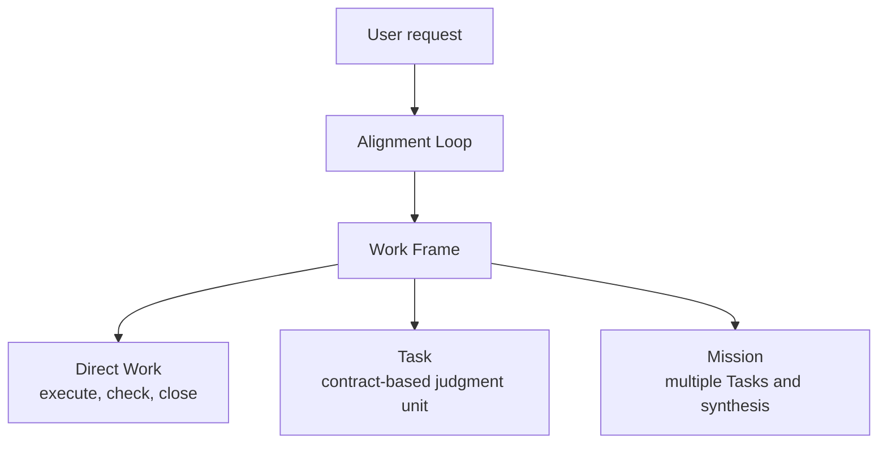
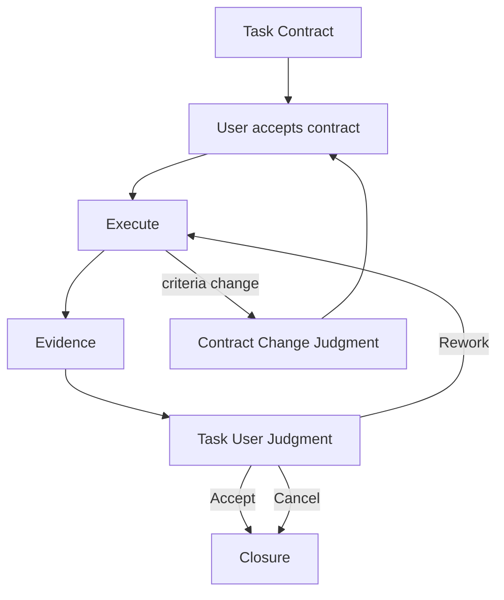

English | [한국어](README.ko.md)


# Geas

Geas is a set of operating principles and Skills that structure AI agent work around explicit contracts, execution, Evidence, User Judgment, and reflection so humans can judge results responsibly at lower cost.

## Why Geas Exists

AI agents can produce outputs quickly. But when fast outputs do not preserve the goal, criteria, checked scope, and unchecked scope, the cost of human review and acceptance judgment grows.

Geas reduces the total cost of reviewing, judging, maintaining, and continuing agent work. Productivity is not just output speed. Long-term productivity comes from making fast work remain reviewable, evidence-backed, and recoverable.

## Benefits

- Turns ambiguous requests into Mission and Task contracts with clear execution criteria and excluded scope.
- Splits large work into Task units that humans can review and judge.
- Fixes acceptance criteria, verification checks, and review focus before judging the result.
- Keeps verification evidence, unchecked scope, and remaining risks with the implementation result.
- Separates implementation, verification, review, and challenge so context, quality, omissions, and long-term risks can be inspected independently.
- Returns to baseline revision instead of silently expanding scope when the criteria change during work.
- Lets interrupted work resume from accepted Mission criteria, Task criteria, Evidence, User Judgment, and continuity context.
- Keeps closure records and typed memory so remaining limits and repeatable lessons feed the next work.

## What Geas Is

Geas treats agent work as a basic operating flow.

- Before execution, fix the goal, scope, deliverables, verification method, and non-goals as a contract.
- The agent works inside that contract and leaves verification evidence and unchecked scope.
- The human reviews the evidence and judges whether to accept the result.
- Facts discovered during work become reflection and memory for future work.

This repository contains the documentation, Skill workflows, and marketplace plugin packages for Codex and Claude Code.

## Installation

Use one of the following methods.

<details>
<summary>Install through the Codex marketplace</summary>

```text
/plugin marketplace add choam2426/geas
/plugin install geas@geas
```

</details>

<details>
<summary>Install through the Claude Code marketplace</summary>

```text
/plugin marketplace add choam2426/geas
/plugin install geas@geas
```

</details>

<details>
<summary>Install as Codex project-local Skills</summary>

```bash
git clone https://github.com/choam2426/geas.git
mkdir -p .agents/skills
cp -R geas/plugins/geas/skills/* .agents/skills/
```

</details>

<details>
<summary>Install as Claude Code project-local Skills</summary>

```bash
git clone https://github.com/choam2426/geas.git
mkdir -p .claude/skills
cp -R geas/plugins/geas/skills/* .claude/skills/
```

</details>

## Usage

After installing Geas, open Codex or Claude Code in your project and use `/geas` to start or resume Geas work.

If work is interrupted, call `/geas` again to continue from the accepted Mission criteria, Task criteria, Evidence, User Judgment, and continuity context.

```text
/geas Add login error messages that tell users why sign-in failed
```

```text
/geas Continue the current Mission
```

Geas does not push the agent to declare completion immediately. It first fixes the working criteria, then leaves Evidence from execution so a human can review the result and make a User Judgment.

## Core Workflow

Every request becomes a `Work`. The agent aligns the request into a Work Frame, then handles it as Direct Work, a Task, or a Mission depending on size, risk, and judgment cost.


```mermaid
flowchart TD
  request["User request"] --> align["Alignment Loop"]
  align --> frame["Work Frame"]
  frame --> direct["Direct Work<br/>execute, check, close"]
  frame --> task["Task<br/>contract-based judgment unit"]
  frame --> mission["Mission<br/>multiple Tasks and synthesis"]
```

- `Direct Work` runs on a short Work Frame: execute, report the result with checks and limits, close.
- A `Task` fixes execution criteria as a Task Contract the user accepts before execution, and ends with a Task User Judgment.
- A `Mission` groups multiple Tasks under a Mission Brief and synthesizes accepted Task results for a Mission-level judgment.

A Task moves through this flow.


```mermaid
flowchart TD
  contract["Task Contract"] --> accept["User accepts contract"]
  accept --> execute["Execute"]
  execute --> evidence["Evidence"]
  evidence --> judgment["Task User Judgment"]
  judgment -->|"Accept"| closure["Closure"]
  judgment -->|"Rework"| execute
  judgment -->|"Cancel"| closure
  execute -->|"criteria change"| amend["Contract Change Judgment"]
  amend --> accept
```

Evidence is strengthened with verification, review, or challenge when risk, impact, or judgment cost is high. When criteria change during execution, the user decides whether to amend the contract, keep it, or cancel — work never silently drifts from the accepted criteria.

Records live under `.geas/works/` so interrupted Work resumes from the same criteria, and durable decisions are kept as memory under `.geas/memory/` for later Work.

## Core Concepts

- `Work`: One unit of work the user delegates. Every Work starts from a Work Frame and is handled as Direct Work, a Task, or a Mission.
- `Task Contract`: The execution agreement the user accepts before a Task runs: goal, boundary, deliverable, acceptance criteria, and verification strategy.
- `Mission`: A larger Work that groups multiple Tasks and judgment points under a Mission Brief and ends with Mission-level synthesis.
- `Evidence`: How the result compares to the accepted criteria, what was checked, and what remains unchecked. It is not a completion declaration; it is the user's judgment input.
- `User Judgment`: The user's explicit decision on result and Evidence: Accept, Rework, or Cancel for a Task; Accept, Continue, or Cancel for a Mission.
- `Continuity`: Closure records that let interrupted Work resume, and Continuity Artifacts kept as typed memory for later Work.

## Start Here

- [Geas definition](docs/definition.md)
- [Geas Workflow](docs/workflow/index.md)
- [Skill structure](docs/skills.md)

## License

Apache License 2.0. See [LICENSE](LICENSE).
