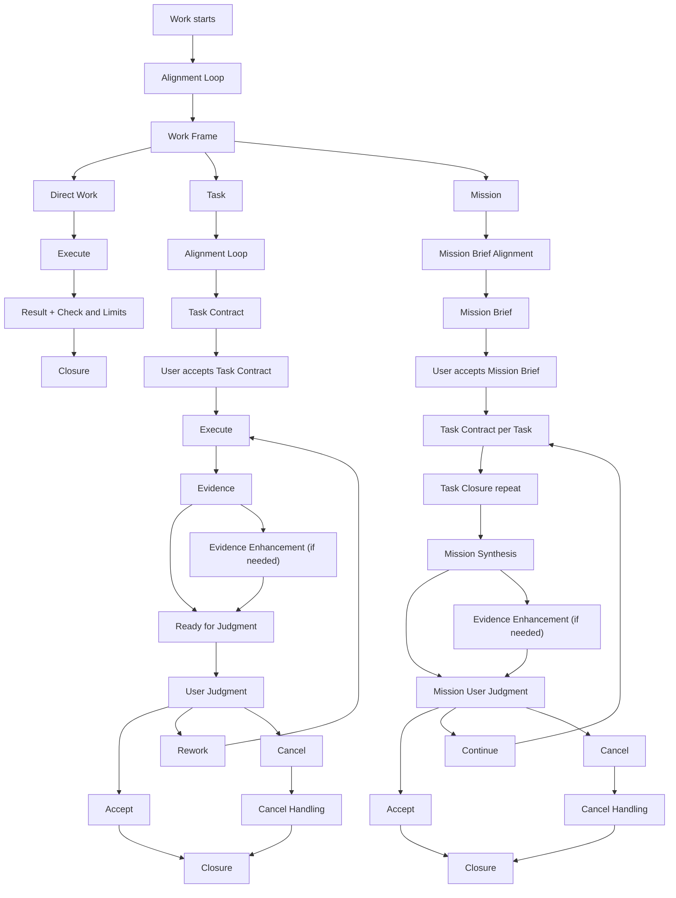

# Geas Workflow

## 목적

Geas Workflow는 Human-Agent Work Harness의 정의를 실제 작업 흐름으로 옮기는 기준이다.

이 workflow는 User가 Agent에게 맡긴 작업을 실행 가능한 구조, 검토 가능한 판단 지점, 복원 가능한 상태로 바꾼다. Agent는 User가 목표, 범위, 충분한 상태, 확인한 것과 남은 한계를 낮은 비용으로 판단할 수 있게 만드는 데 초점을 둔다.

## 기본 단위

Geas Workflow의 기본 작업 단위는 `Work`다.

`Work`는 User가 Agent에게 맡긴 하나의 작업이다. 모든 `Work`는 실행 전에 `Work Frame`을 통해 작업 배경과 다룰 방식을 정리한다. `Work`는 크기, 위험, 판단 지점 수에 따라 `Direct Work`, `Task`, `Mission`으로 다뤄진다.

```text
Work
  has Work Frame

Work can be:
  Direct Work
  Task
  Mission

Mission
  contains Tasks
```

`Mission`은 여러 `Task`와 판단 지점을 포함하는 큰 `Work`다.

## Workflow 흐름

모든 `Work`는 `Alignment Loop`를 거쳐 `Work Frame`으로 정리된다. `Alignment Loop`는 흐린 요청을 작업 가능한 공통 기준으로 구체화하고, `Work Frame`은 작업 배경, 확인한 맥락, 고려할 점, 처리 방식 제안을 남긴다. 이후 `Work`는 `Direct Work`, `Task`, `Mission` 중 하나의 방식으로 다뤄진다.



`Task`와 `Mission`은 User가 기준을 받아들인 뒤 실행한다. `Closure`는 결과, 확인 근거, User 판단, 필요한 복원 정보, `Continuity Artifact Review` 결과, 작업 방식 개선 후보를 `Work` 단위에 맞게 남긴다.

## 문서 구성

|문서|책임|
|---|---|
|[alignment.md](./alignment.md)|흐린 목표와 의도를 상호작용으로 구체화하는 `Alignment Loop`를 정의한다.|
|[work-frame.md](./work-frame.md)|`Work Frame`, `Direct Work`, `Direct Work`에서 `Task`로 승격하는 기준을 정의한다.|
|[evidence-judgment.md](./evidence-judgment.md)|`Evidence`, verification/review/challenge 강화 절차, 일반 `User Judgment` 기준을 정의한다.|
|[task.md](./task.md)|`Task`, `Task Contract`, `Task User Judgment`를 정의한다.|
|[mission.md](./mission.md)|`Mission`, `Mission Brief`, `Mission Synthesis`, `Task`에서 `Mission`으로 승격하는 기준, `Mission User Judgment`를 정의한다.|
|[continuity.md](./continuity.md)|`Closure`와 `Continuity Artifact`를 정의한다.|
|[feedback.md](./feedback.md)|User feedback을 기준 갱신으로 바꾸는 흐름을 정의한다.|
