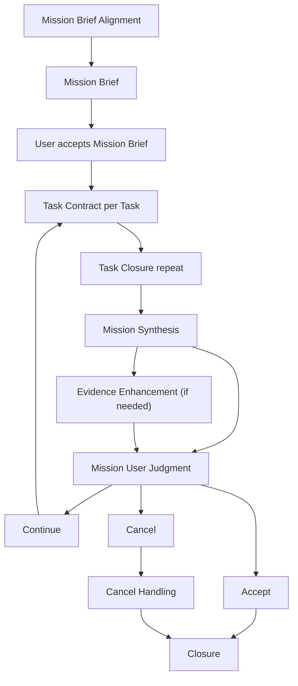

# Mission

## 목적

`Mission`은 여러 `Task`와 여러 User 판단 지점을 묶어 큰 목표를 다루는 상위 작업 구조다.

`Mission`은 하나의 `Task` 결과와 `Evidence`로 전체 목표를 판단하기 어려울 때 사용한다.

`Mission`의 경계는 User 판단 비용으로 정한다. 여러 `Task` 결과를 종합해야 하거나, 중간 결정이 이후 작업을 바꾸거나, 다음 작업에서 다시 참조할 메모리가 필요하면 `Mission`으로 다룬다.

`Mission`은 필요한 경우 공유 [Harness Setup](./harness-setup.md) 결과를 `Key Context`, `Shared Considerations`, `Validation And Review Strategy`, `Continuity Needs`에 반영한다. Task별 준비 결과는 각 `Task`의 기존 필드에서 다룬다.

## Mission 흐름

`Mission`은 큰 목표를 `Mission Brief`로 정리하고, 여러 `Task` 결과를 종합해 Mission 수준의 User Judgment로 판단한다.

각 단계의 역할은 다음과 같다.

|단계|역할|
|---|---|
|`Mission Brief Alignment`|큰 목표, Task 구조, Mission 수준 판단 지점, 종합 기준을 User와 같은 판단 표면에 놓는다.|
|`Mission Brief`|여러 `Task`가 공유할 목표, 경계, 기준, 고려 사항, 진행 구조를 고정한다.|
|`User accepts Mission Brief`|User가 `Mission Brief`를 Mission 작업 기준으로 받아들인다.|
|`Task Contract per Task`|각 `Task`가 실행 전에 별도 `Task Contract`를 정리한다.|
|`Task Closure repeat`|각 `Task`가 결과, `Evidence`, User Judgment, 필요한 복원 정보로 Closure 기준을 충족한다.|
|`Mission Synthesis`|수용된 `Task` 결과와 `Evidence`, 남은 한계, `Continuity Artifact` 후보를 Mission 기준에 대조한다.|
|`Evidence Enhancement`|Mission 수준 위험, 영향 범위, 판단 비용이 크면 verification, review, challenge를 통해 종합 근거를 강화한다.|
|`Mission User Judgment`|User가 `Mission Synthesis`를 보고 `Accept`, `Continue`, `Cancel` 중 하나를 판단한다.|
|`Accept`|User가 수용된 `Task` 결과와 남은 한계를 포함해 Mission 결과를 받아들인다.|
|`Continue`|추가 `Task`, 기준 조정, 보완 확인을 이어간다.|
|`Cancel`|현재 `Mission` 결과를 수용 범위 밖에 두고 현재 상태로 정리한다.|
|`Cancel Handling`|이미 수용된 `Task` 결과, 참고자료, 새 `Work Frame` 필요 여부를 정리한다.|
|`Closure`|Mission 결과, `Evidence`, User 판단, 복원 정보, `Continuity Artifact Review` 결과, 작업 방식 개선 후보를 정리한다.|

`Continue` 중 `Mission Brief`의 목표, 경계, 수용 기준, Task 구조가 바뀌면 User 재수용을 받고 이후 `Task Contract`를 갱신한다.

## Mission Brief Alignment

`Mission Brief`를 위한 Alignment는 큰 목표를 여러 `Task`와 Mission 수준 판단 지점으로 나누는 과정이다.

Agent는 질문의 가치가 높은 지점부터 다룬다. 질문의 가치는 답이 `Task Structure`, Mission 수용 기준, `Evidence`, `Mission Synthesis`를 바꾸는 정도와 지금 맞출 때 줄어드는 재작업 비용으로 판단한다. 영향이 작은 항목은 Agent 가정이나 열린 질문으로 남기고 진행한다.

Task 구조나 접근 선택이 결과, 수용 기준, `Evidence`를 바꾸면 Agent는 선택지, tradeoff, 위험을 먼저 드러낸다. 접근 후보가 여러 개면 2-3개로 좁혀 Mission 기준, Task 구조, 확인 비용, 위험을 비교한다.

Task 구조는 Mission 범위와 기준을 어느 정도 덮는지 확인한다. Agent는 각 Mission 기준이 어떤 `Task`에서 다뤄지는지, `Task` 간 중복과 의존성, `Task` 크기의 균형을 드러낸다.

Mission 수준 판단과 Task 수준 판단은 나누어 정한다. Mission 수준에서는 큰 목표, 종합 기준, Task 구조, `Continuity Artifact` 후보를 판단하고, Task 수준에서는 실행 목표, 산출물, 수용 기준, 확인 계획을 판단한다.

`Mission Synthesis`는 Alignment 단계에서 미리 설계한다. Agent는 각 `Task` 결과와 `Evidence`, 남은 한계가 최종 판단 표면에서 어떤 항목으로 합쳐지는지 정리한다.

User 피드백이 방향, 범위, 기준, Task 구조를 바꾸면 Agent는 피드백을 다음 실행 기준으로 정리한다. 이때 가능한 해석, 바뀐 기준, 유지할 기준, 갱신할 `Mission Brief` 항목을 드러낸다.

Agent는 다음 행동 전 현재 합의를 다시 확인한다. 확인 대상은 `Mission Intent`, `Mission Boundary`, `Mission Criteria`, `Task Structure`, `Decision Points`, 열린 질문이다.

판단 표면은 User가 선택하기 쉬운 형태로 단계화한다. 짧은 질문으로 충분하면 텍스트로 묻고, 기준 비교는 표로 정리하고, Task 흐름과 의존성은 Mermaid로 보여주고, 우선순위 조정이나 시각 비교처럼 문장 설명의 판단 비용이 크면 HTML 산출물, 실행 결과 캡처, 비교 화면을 사용한다.

review나 challenge가 필요하면 어떤 관점을 분리된 context나 sub agent에서 볼지 함께 정한다.

|질문|드러낼 것|
|---|---|
|이 `Mission`은 어떤 큰 목표를 다루는가?|`Mission Intent`, `Success Shape`|
|왜 `Mission`으로 다루는가?|`Mission Background`, `Mission Criteria`|
|어디까지 다루고 어디를 범위 밖에 두는가?|`Mission Boundary`, `Shared Considerations`|
|어떤 접근으로 진행하는가?|`Approach`, `Accepted Decisions`|
|모든 `Task`가 공유해야 할 맥락과 준비 상태는 무엇인가?|`Key Context`|
|어떤 `Task`들로 나누는가?|`Task Structure`|
|Task 구조가 Mission 범위와 기준을 어떻게 덮는가?|`Task Structure`, `Task Structure Coverage`|
|각 `Task`는 어떤 Mission 기준에 기여하는가?|`Task Contribution Map`|
|어떤 판단은 Mission 수준에 남기고 어떤 판단은 Task에서 다루는가?|`Decision Points`, `Task Judgment Boundary`|
|User가 Mission 수준에서 판단해야 할 지점은 무엇인가?|`Decision Points`|
|결과나 변경이 닿을 수 있는 표면은 어디인가?|`Impact Surface`|
|Mission 결과를 어떤 기준으로 종합하는가?|`Mission Criteria`, `Mission Synthesis`|
|각 `Task` 결과를 최종 판단 표면에서 어떻게 종합하는가?|`Mission Synthesis Plan`, `Task Contribution Map`|
|Mission 수준에서 어떤 확인 표면과 Evidence 강화가 필요한가?|`Validation And Review Strategy`|
|어떤 조건에서 Mission 기준을 다시 정하는가?|`Change Triggers`|
|Mission 밖으로 이어질 상태는 무엇인가?|`Continuity Needs`, `Continuity Artifact Candidates`|

## Mission Brief

`Mission Brief`는 큰 목표를 여러 `Task`와 판단 지점으로 다루기 위한 상위 조율 기준이다.

`Mission Brief`는 여러 `Task`가 같은 목표, 배경, 경계, 고려 사항을 공유하게 하고, User가 Mission 수준에서 어디를 판단해야 하는지 드러낸다. 실행 기준은 각 `Task Contract`에서 고정한다.

`Mission Brief`는 [Alignment Loop](./alignment.md)를 거쳐 작성한다. 이 loop는 큰 목표, Task 구조, Mission 수준 판단 지점, 공유 고려 사항, 기준 변경 조건을 User와 Agent가 같은 기준으로 볼 수 있게 맞춘다.

`Mission Brief`는 다음 내용을 정리한다.

|항목|역할|
|---|---|
|Mission Intent|큰 `Work`에서 이루려는 방향과 목적을 정리한다.|
|Mission Background|이 `Mission`이 필요한 이유를 정리한다.|
|Mission Boundary|`Mission`이 다루는 범위와 범위 밖에 둘 내용을 고정한다.|
|Success Shape|`Mission`이 충분하다고 볼 전체 모습을 정리한다.|
|Mission Criteria|Mission 결과를 수용 판단할 기준과 각 기준이 `Evidence`로 어떻게 확인될지 정리한다.|
|Approach|`Mission`을 어떤 접근으로 진행할지와 그 이유를 정리한다.|
|Accepted Decisions|User가 받아들인 접근, 선택, tradeoff, 조건, 위험 수용을 고정한다.|
|Key Context|모든 `Task`가 계속 참고해야 할 User 의도, 도메인 맥락, 환경 정보, 제약, 선행 결정을 정리한다.|
|Task Structure|`Mission`을 어떤 `Task`들로 나누어 다룰지 정리한다.|
|Task Structure Coverage|각 Mission 기준이 어떤 `Task`에서 다뤄지는지, `Task` 간 중복과 의존성, `Task` 크기의 균형을 정리한다.|
|Task Contribution Map|각 `Task`가 어떤 Mission 기준에 기여하는지 연결한다.|
|Task Judgment Boundary|Mission 수준 User 판단과 Task 수준 User 판단을 나누어 정리한다.|
|Decision Points|User 판단이 필요한 지점을 정리한다.|
|Mission Synthesis Plan|각 `Task` 결과, `Evidence`, 남은 한계를 Mission 수준 판단 표면에서 어떻게 종합할지 정리한다.|
|Shared Considerations|모든 `Task`가 공유해야 할 제약, style, conventions, 위험, tradeoff를 정리한다.|
|Impact Surface|변경이나 산출물이 영향을 줄 수 있는 파일, 문서, 흐름, 의존 관계, 부수 영향 가능 범위를 정리한다.|
|Validation And Review Strategy|Mission 수준에서 필요한 verification surface, review, challenge, 수동 확인의 전략과 분리된 context 사용 조건을 정리한다.|
|Change Triggers|`Mission Brief`나 이후 `Task Contract`를 다시 정해야 하는 조건을 정리한다.|
|Continuity Needs|`Mission` 중 복원하거나 인계해야 할 작업 준비 상태와 진행 상태를 정리한다.|
|Continuity Artifact Candidates|`Mission` 밖으로 이어질 수 있는 결정, 위험, 열린 질문, 메모리 후보를 정리한다.|

`Mission Brief`는 `Mission` 실행 전에 User가 받아들여야 한다. `Mission` 안의 `Task Contract`는 `Mission Brief`를 기준으로 작성한다.

`Mission Brief`가 바뀌면 User 재수용을 받고, `Task Structure`와 이후 `Task Contract`를 갱신한다. 이미 User가 수용한 `Task` 결과는 새 `Mission Brief` 기준에서 재사용, 참고, 보완, 범위 밖 보존 중 하나로 분류한다.

## Mission Synthesis

`Mission Synthesis`는 수용된 `Task` 결과, `Evidence`, 남은 한계, `Continuity Artifact` 후보를 `Mission Brief` 기준으로 종합하는 판단 표면이다.

User는 `Mission Synthesis`를 보고 `Mission` 결과를 `Accept`, `Continue`, `Cancel` 중 하나로 판단한다.

`Mission Synthesis`는 다음 내용을 정리한다.

|항목|역할|
|---|---|
|Mission Result|`Mission`이 실제로 어떤 상태까지 도달했는지 종합한다.|
|Task Results Summary|각 `Task`가 무엇을 남겼고 어떤 User Judgment를 받았는지 종합한다.|
|Criteria Check|`Mission Brief`의 `Success Shape`, `Mission Boundary`, `Mission Criteria`, `Decision Points` 기준으로 결과를 대조한다.|
|Evidence Summary|Mission 판단에 쓰는 `Evidence`, 강화 절차, 판단 표면을 종합한다.|
|Remaining Limits|미확인 범위, 남은 위험, User가 받아들여야 할 한계를 종합한다.|
|Decision Points|Mission User Judgment 전에 User가 판단해야 할 항목을 드러낸다.|
|Continuity Artifact Candidates|`Mission` 밖으로 이어질 메모리 후보를 종합한다.|

`Mission Accept`는 수용된 `Task` 결과들을 `Mission Brief` 기준으로 다시 대조한 뒤, User가 전체 `Mission` 결과를 받아들일 때 성립한다.

## Task에서 Mission으로 승격하는 기준

다음 조건 중 하나가 생기면 `Work`는 `Task`에서 `Mission`으로 승격한다.

|승격 기준|의미|
|---|---|
|수용 판단이 여러 번 필요하다.|전체 `Work`를 여러 판단 단위로 나누어 받아들인다.|
|공유 준비와 개별 준비가 함께 필요하다.|Mission 수준 준비와 Task별 준비를 나누어 다뤄야 한다.|
|중간 방향 결정이 이후 작업을 바꾼다.|초기 결정, 설계, 기준 선택, 우선순위 판단이 다음 실행에 영향을 준다.|
|여러 `Task` 결과를 종합해야 한다.|각 `Task`는 수용 가능해도 전체 목표 충족 여부는 별도로 판단해야 한다.|
|작업 기준이 실행 중 구체화된다.|User가 중간 결과를 보고 범위, 기준, 방향을 조정할 수 있다.|
|진행 상태를 복원해야 한다.|세션 전환, 컨텍스트 압축, 작업자 교체 뒤에도 이어갈 상태가 필요하다.|
|산출물이나 영향 범위가 여러 갈래다.|문서, 코드, UI, 정책처럼 서로 다른 검토 방식이 섞인다.|
|위험과 미확인 범위가 누적된다.|개별 `Task`의 한계가 전체 `Work`의 수용 판단에 영향을 준다.|
|마지막에 Mission 수준 종합이 필요하다.|수용된 `Task` 결과를 전체 목표와 기준에 다시 대조한다.|

다음 조건을 만족하면 `Task`로 유지한다.

|Task 유지 기준|의미|
|---|---|
|결과와 `Evidence`를 한 번에 판단할 수 있다.|User가 하나의 수용 판단으로 결과를 받아들일 수 있다.|
|실행 단계가 많아도 판단 기준은 하나다.|작업량은 크지만 수용 기준, 확인 방법, 위험 판단이 한 묶음이다.|
|중간 방향 결정이 현재 결과 기준 안에 머문다.|Agent 내부 실행 순서가 길어도 User 판단 지점은 하나로 유지된다.|
|남은 한계가 하나의 판단 범위 안에 머문다.|미확인 범위와 위험을 하나의 `Task`가 남긴 `Evidence` 안에서 판단할 수 있다.|

## Mission User Judgment

|판단|의미|
|---|---|
|Accept|수용된 `Task` 결과와 남은 한계를 포함해 `Mission` 결과를 받아들인다.|
|Continue|추가 `Task`, 기준 조정, 보완 확인을 이어간다.|
|Cancel|현재 `Mission` 결과를 수용 범위 밖에 두고 현재 상태로 정리한다. 이미 User가 수용한 `Task` 결과는 별도 판단으로 다룬다.|
