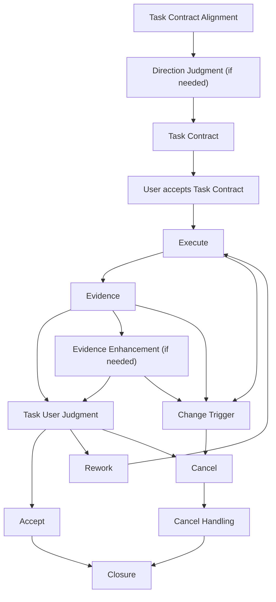

# Task

## 목적

`Task`는 User가 결과와 `Evidence`를 한 번에 보고 `Accept`, `Rework`, `Cancel`을 판단할 수 있게 묶은 User Judgment 단위다.

`Task`는 결과, 실행 기준, 확인 방법, 남은 한계를 하나의 판단 표면으로 정리해야 할 때 사용한다.

`Task`의 경계는 User 판단 비용으로 정한다.

## Task 분리 기준

하나의 `Task`에는 하나의 목적, 하나의 수용 기준 묶음, 하나의 확인 전략, 설명 가능한 영향 범위가 있다.

User가 결과, `Evidence`, 남은 한계를 한 번에 판단할 수 있으면 하나의 `Task`로 묶는다. `Task`는 User가 판단할 만큼 작고, 판단과 기록 비용을 감당할 만큼 커야 한다.

다음 조건 중 하나가 생기면 `Task`를 나눈다.

|분리 기준|의미|
|---|---|
|수용 기준이 다르다.|User가 결과를 받아들일 기준이 달라진다.|
|기준 산출물과 실행 결과가 함께 있다.|User가 기준, 설계, 방향을 먼저 받아들인 뒤 실행 결과를 판단해야 한다.|
|산출물 성격이 다르다.|문서, 코드, UI, 데이터처럼 결과의 검토 방식이 달라진다.|
|확인 방법이 다르다.|테스트, 실행 확인, review, 수동 확인처럼 Evidence가 나뉜다.|
|영향 범위가 다르다.|결과나 변경이 닿는 파일, 문서, 흐름, 의존 관계가 달라진다.|
|위험 수준이 다르다.|되돌리기 비용, 장기 비용, 품질 부채, 기준 이탈 위험을 별도로 판단해야 한다.|
|User가 중간 방향을 정한다.|User 판단이 이후 결과, 범위, 기준을 바꾼다.|
|별도 설명 기준이 필요하다.|결과와 판단 기준을 이해하려면 별도 판단 표면이 필요하다.|

실행 중 서로 다른 판단이 섞인 것이 드러나면 `Task Contract`를 다시 정리하거나 `Task`를 나눈다.

## Task 흐름

`Task`는 실행 기준을 정하고, 결과와 `Evidence`를 User Judgment로 판단한다.

`Rework`는 같은 `Task Contract` 안에서 실행, 확인, 정리의 부족한 부분을 다시 진행하는 흐름이다. 기준이 바뀌면 `Change Trigger`로 보고 현재 `Task`를 `Cancel`한 뒤 새 `Work Frame`으로 돌아간다.

각 단계의 역할은 다음과 같다.

|단계|역할|
|---|---|
|`Task Contract Alignment`|실행 기준, 산출물, 수용 기준, 확인 계획, 판단 지점을 User와 같은 판단 표면에 놓는다.|
|`Direction Judgment`|방향 선택이 결과, 수용 기준, `Evidence`를 바꾸면 선택지, tradeoff, 위험을 User가 판단하기 쉬운 형태로 드러낸다.|
|`Task Contract`|Agent가 실행할 기준과 User가 판단할 기준을 고정한다.|
|`User accepts Task Contract`|User가 `Task Contract`를 작업 기준으로 받아들인다.|
|`Execute`|Agent가 `Task Contract` 기준 안에서 실제 작업을 수행한다.|
|`Evidence`|Agent가 결과를 기준에 대조하고 확인 근거, 남은 한계, 판단 지점을 남긴다.|
|`Evidence Enhancement`|위험, 영향 범위, 판단 비용이 크면 verification, review, challenge를 통해 `Evidence`를 강화한다.|
|`Task User Judgment`|User가 결과와 `Evidence`를 보고 `Accept`, `Rework`, `Cancel` 중 하나를 판단한다.|
|`Accept`|User가 현재 결과와 `Evidence`를 기준으로 `Task` 결과를 받아들인다.|
|`Rework`|현재 `Task Contract` 안에서 부족한 실행, 확인, 정리를 다시 진행한다.|
|`Cancel`|현재 `Task` 결과를 수용 범위 밖에 두고 가능한 범위에서 `Task` 시작 전 상태로 되돌린다.|
|`Cancel Handling`|rollback, 참고자료 보존, 새 `Work Frame` 작성 같은 후속 처리를 정리한다.|
|`Change Trigger`|목표, 경계, 산출물, 수용 기준, 확인 방법, 영향 범위, 위험 수준의 변화를 드러낸다.|
|`Closure`|결과, `Evidence`, User 판단, 필요한 복원 정보, `Continuity Artifact Review` 결과, 작업 방식 개선 후보를 정리한다.|

## Task Contract Alignment

`Task Contract`를 위한 Alignment는 `Task` 실행 기준과 User Judgment 기준을 같은 판단 표면에 놓는 과정이다.

방향 선택이 결과, 수용 기준, `Evidence`를 바꾸면 Agent는 선택지, tradeoff, 위험을 먼저 드러낸다. 문장만으로 판단 비용이 커지면 표, Mermaid, HTML 산출물, 실행 결과 캡처, 비교 화면을 사용한다.

review나 challenge가 필요하면 어떤 관점을 분리된 context나 sub agent에서 볼지 함께 정한다.

|질문|드러낼 것|
|---|---|
|이 `Task`는 어떤 결과를 남기는가?|`Goal`, `Deliverable`|
|이 `Task`는 `Work Frame` 또는 `Mission Brief`에서 어떤 부분을 맡는가?|`Work Relation`|
|어디까지 실행하고 어디를 범위 밖에 두는가?|`Boundary`, `Guardrails`|
|결과, 수용 기준, `Evidence`를 바꾸는 선택은 무엇인가?|`Accepted Decisions`|
|User가 이미 받아들인 선행 결정과 입력은 무엇인가?|`Accepted Decisions`, `Starting Context`|
|Agent는 실제로 무엇을 수행하는가?|`Execution`|
|User는 어떤 기준으로 결과를 받아들이는가?|`Acceptance Criteria`|
|결과나 변경이 닿을 수 있는 표면은 어디인가?|`Impact Surface`|
|보고 전에 무엇을 확인하는가?|`Verification Strategy`|
|User 판단 비용을 낮추는 `Evidence` 형식은 무엇인가?|`Evidence Plan`|
|review나 challenge가 필요하면 어떤 관점을 분리된 context에서 볼 것인가?|`Review And Challenge Focus`|
|User는 무엇을 보고 판단하는가?|`User Judgment Point`|
|어떤 조건에서 현재 `Task` 기준을 다시 정하는가?|`Change Triggers`|
|`Cancel`이 발생하면 어떤 후속 처리를 하는가?|`Cancel Handling`|

## Task Contract

`Task Contract`는 `Task` 실행과 User Judgment를 위한 상세 실행 합의다.

`Work Frame`은 작업 전 배경과 고려할 점을 정리하고, `Task Contract`는 `Task`를 실행하기 전에 실제 실행 기준을 합의한다. Agent는 `Task Contract`를 기준으로 실행하고, User는 `Task Contract`를 기준으로 `Accept`, `Rework`, `Cancel`을 판단한다.

`Task Contract`는 [Alignment Loop](./alignment.md)를 거쳐 작성한다. 이 loop는 실행 기준, 산출물, 수용 기준, 확인 계획, 취소 처리를 User와 Agent가 같은 기준으로 볼 수 있게 맞춘다.

`Task Contract`는 다음 내용을 정리한다.

|항목|역할|
|---|---|
|Goal|`Task`가 이루려는 목표를 고정한다.|
|Work Relation|`Work Frame` 또는 `Mission Brief`에서 이 `Task`가 담당하는 기준과 맥락을 고정한다.|
|Boundary|포함 범위와 범위 밖에 둘 내용을 고정한다.|
|Accepted Decisions|User가 받아들인 접근, 선택, tradeoff, 조건, 위험 수용을 고정한다.|
|Starting Context|수용된 선행 결과, 기준 산출물, 필요한 입력, 전제, 먼저 읽거나 확인할 파일, 문서, 테스트, 실행 흐름을 고정한다.|
|Execution|Agent가 실제로 수행할 작업을 고정한다.|
|Deliverable|`Task`가 남길 결과물을 고정한다.|
|Acceptance Criteria|User가 받아들일 기준을 고정한다.|
|Guardrails|지켜야 할 제약, 보존할 영역, 유지해야 할 기준을 고정한다.|
|Impact Surface|변경이나 산출물이 영향을 줄 수 있는 파일, 문서, 흐름, 의존 관계를 고정한다.|
|Verification Strategy|어떤 테스트, 실행 확인, 수동 확인, regression 확인을 수행할지 고정한다.|
|Review And Challenge Focus|review와 challenge에서 볼 품질, 경계, 사용자 영향, edge case, 유지보수 위험, 분리된 context 사용 조건을 고정한다.|
|Evidence Plan|어떤 Evidence를 어떤 판단 표면으로 남기고 어떤 미확인 범위와 한계를 드러낼지 고정한다.|
|User Judgment Point|User가 무엇을 보고 `Accept`, `Rework`, `Cancel`을 판단할지 고정한다.|
|Change Triggers|목표, 경계, 산출물, 수용 기준, 확인 방법, 영향 범위, 위험 수준을 다시 봐야 하는 조건을 고정한다.|
|Cancel Handling|`Cancel` 시 rollback, 참고자료 보존, 새 `Work Frame` 작성 등 후속 처리를 고정한다.|

`Accepted Decisions`는 방향 선택, tradeoff, 조건, 위험 수용처럼 실행 기준을 바꾸는 User 결정을 고정한다. `Starting Context`는 실행 전에 이해해야 할 기준과 입력이다. `Impact Surface`는 변경이나 산출물이 닿을 수 있어 확인해야 할 표면이다. `Verification Strategy`는 실제 확인 행위를 정한다. `Review And Challenge Focus`는 분리된 context에서 볼 관점을 정하고, `Evidence Plan`은 User 판단을 위해 남길 근거, 판단 표면, 한계를 정한다.

`Task`는 실행 전에 `Task Contract`를 User가 받아들여야 한다. `Task`의 `Goal`, `Boundary`, `Execution`, `Deliverable`, `Acceptance Criteria`, 확인 방법, 영향 범위, 위험 수용 조건이 바뀌면 현재 `Task`를 `Cancel`하고 새 `Work Frame`을 작성한다.

## Task User Judgment

|판단|의미|
|---|---|
|Accept|현재 결과와 `Evidence`를 기준으로 `Task` 결과를 받아들인다.|
|Rework|현재 `Task` 기준을 유지한 채 실행, 확인, 정리의 부족한 부분을 다시 진행한다.|
|Cancel|현재 `Task` 결과를 수용 범위 밖에 두는 판단이다. 기본 처리는 가능한 범위에서 `Task` 시작 전 상태로 되돌리는 것이다.|

`Rework`는 같은 `Task Contract` 안에서만 사용한다. `Goal`, `Boundary`, `Execution`, `Deliverable`, `Acceptance Criteria`, 위험 수용 조건이 바뀌면 현재 `Task`를 `Cancel`하고 새 `Work Frame`을 작성한다.

`Cancel`은 필요한 후속 처리를 함께 남긴다. 후속 처리는 가능한 범위의 rollback, 수용 범위 밖에 둔 결과의 참고자료 보존, 새 `Work Frame` 작성으로 나뉠 수 있다. rollback 범위 밖에 남는 변경, 참고할 만한 결과, 새 `Work`에 넘길 기준 변화는 `Closure`에 남긴다.
